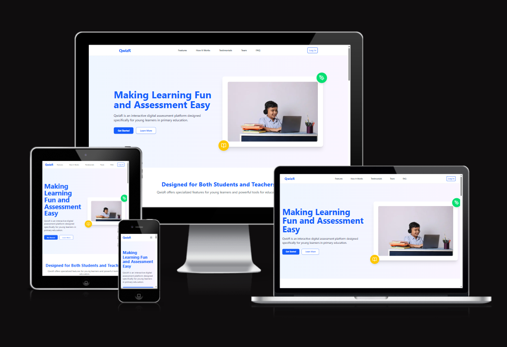

<div align="center">
  
  
  
   <a href="https://github.com/navjot369/QwizR/graphs/commit-activity">
  
  </a>
</div>
<br><br>

**QwizR** is a specialized online examination platform designed to cater specifically to the needs of **primary school children**. It moves beyond traditional testing by providing an age-appropriate, interactive, and engaging digital assessment system. By integrating elements like an **Interactive Drawing Board**, **Picture-Based Matching**, and **Digital Whiteboard**, QwizR makes assessment a positive learning experience. For educators, the platform provides powerful **AI-Powered Question Suggestions** and **Real-Time Monitoring** capabilities, streamlining test creation and progress tracking to complement traditional teaching methods effectively.

---

## ✨ Features

### 🧑‍🎓 Student Experience
QwizR ensures testing is fun and intuitive for young learners.
- **Interactive Drawing Board**: For alphabet and basic shape practice.
- **Picture-Based Matching Exercises**: Visual-enhanced assessments to improve retention.
- **Video-Assisted Questions**: Multimedia content to aid comprehension.
- **Digital Whiteboard**: A space for solving mathematical and visual problems.
- **Simple and Intuitive Interface**: A clean, child-friendly design.
- **Encouraging Feedback System**: Immediate, positive, and constructive feedback.

### 👩‍🏫 Teacher Tools
Educators get powerful tools to simplify their workflow.
- **AI-Powered Question Suggestion System**: Helps generate and suggest relevant, age-appropriate content.
- **Easy-to-Use Test Creation Interface**: Simplifies the design of complex tests.
- **Multiple Question Format Templates**: Diverse options for various assessment needs.
- **Assessment Customization Options**: Tailor tests to specific curriculum requirements.
- **Real-Time Monitoring Capabilities**: Efficiently track individual and class progress.

---

## 🛠️ Technologies Used
QwizR is a **MERN stack** application built with modern, scalable technologies.

- **MongoDB**: The flexible NoSQL database used for data management.
- **Express.js**: A robust Node.js web application framework for building the backend API.
- **React**: A performant JavaScript library for building the user interface.
- **Node.js**: The JavaScript runtime environment for server-side logic.
- **JWT (JSON Web Tokens)**: Used for secure user authentication and authorization.

---

## Installation
1. **Clone the repository:**
    ```
    git clone https://github.com/navjot369/QwizR.git
    ```
2. **Navigate to the project directory:**
    ```
    cd QwizR
    ```
3. **Install backend dependencies:**
    ```
    cd server
    npm install
    ```
4. **Install frontend dependencies:**
    ```
    cd ../client
    npm install
    ```
5. **Set up environment variables:**
   Create a `.env` file in the `server` directory and add the following:
    ```
    MONGODB_URI=your_mongodb_uri
    JWT_SECRET=your_jwt_secret
    ```

## Usage
1. **Start the backend server:**
    ```
    cd server
    npm start
    ```
2. **Start the frontend development server:**
    ```
    cd ../client
    npm start
    ```
3. **Open your browser and navigate to:**
    ```
    http://localhost:3000
    ```

## Project Structure
```
QwizR/
│
├── server/           # Backend code (Express.js)
├── client/           # Frontend code (React)
├── README.md         # Project README file
└── .env.example      # Example environment variables file
```
QwizR/
│
├── server/           # Backend code (Express.js)
├── client/           # Frontend code (React)
├── README.md         # Project README file
└── .env.example      # Example environment variables file
```
(yet to complete)

## 📲 Check Responsive 📲

```QwizR``` is designed with a mobile-first approach, ensuring usability across all devices. Click the image below to check its responsive design.

<div align="center">
  <a href="https://ui.dev/amiresponsive?url=https://qwizr-frontend.vercel.app//" target="_blank">
    
  </a>
</div>

<br><br>


## Contributing

We welcome contributions to QwizR! If you have suggestions, bug reports, or improvements, please open an issue or submit a pull request. Make sure to follow the contribution guidelines.

### Hacktoberfest 2025 Contribution Steps

If you want to participate in Hacktoberfest 2025 and contribute to this project, please follow these steps:

1. **Register for Hacktoberfest**  
   Sign up at [hacktoberfest.com](https://hacktoberfest.com) to connect your GitHub account and track your contributions.

2. **Find Issues to Work On**  
   Look for issues in this repository labeled with `hacktoberfest` or `good first issue` as they are good starting points.

3. **Fork and Clone the Repository**  
   Fork this repo to your GitHub account and clone it to your local machine.

4. **Create a New Branch**  
   Make a new branch for your changes to keep your work organized.

5. **Make Your Contributions**  
   Improve documentation, fix bugs, add features, or improve tests as per the issue or your ideas.

6. **Submit a Pull Request (PR)**  
   Push your changes to your fork and open a PR against the main repository’s main branch.  
   - Follow the project’s contribution guidelines.  
   - Include clear descriptions and link to related issues if applicable.

7. **Get Your PR Reviewed**  
   Respond promptly to any feedback from maintainers and make required revisions.

8. **Ensure Your PR is Accepted or Labeled**  
   For your PR to count towards Hacktoberfest, maintainers must merge it or label it with `hacktoberfest-accepted`.

9. **Complete the Challenge**  
   Submit 6 valid and accepted PRs between October 1 and October 31 to earn your Hacktoberfest rewards.

Happy contributing and thank you for supporting open source!


## License
This project is licensed under the MIT License. See the [LICENSE](LICENSE) file for details.

<div>
  <h2>🙌 Our Amazing Contributors 🙌</h2>
  <a href="https://github.com/repo=navjot369/QwizR/graphs/contributors" align="center">
  
</a>
</div>
<br><br>
<div align="center">
  
  <h3 align="left">Maintained By - Navjot Singh <br>(https://github.com/navjot369)</h3>
</div>

